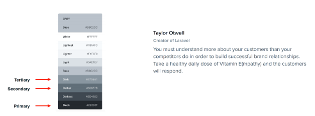
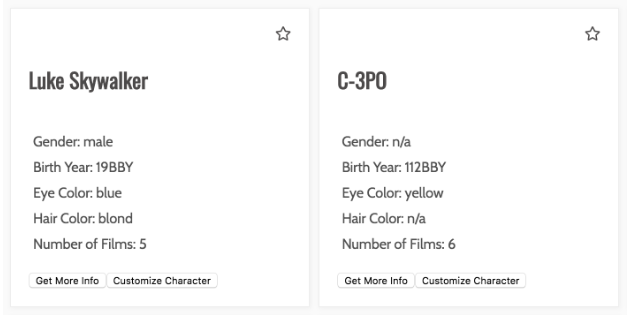
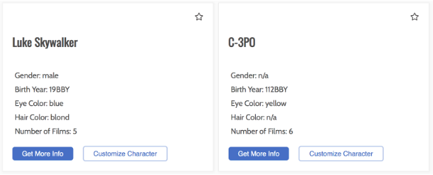
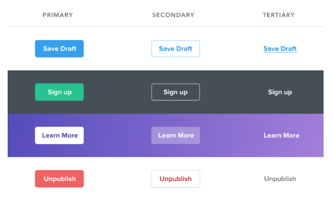
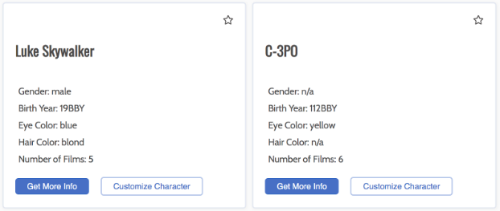

# UX / UI Module

## Learning Goals
This module is _designed_ (😉😉) to teach some basic design principles when styling a web application.  It includes a combination of general design principles, helpful tips and tricks for common CSS issues, and introduces Sass and some of its most helpful starter features.

Goals for this module are:
1. Get an understanding of basic design principles: how to layout an interface and think about mobile responsiveness, how to pick out a useful color palette
2. Learn some tricky CSS moves: best ways to center a div, how to incorporate flexbox and grids
3. An introduction to Sass: CSS preprocessor with some powerful features!

## Setup

Run `npm install` to install dependencies

Run `npm start` to start your server

This should open a new tab in your browser, displaying cards with Star Wars characters on them. If not, you can go to `localhost:8080` to see the app.

The page looks a bit boring though. Let's see if we can make it look better.

## Challenges

### Setup Card Layout

1. Currently, the cards are displayed vertically. Locate the styles.css file and modify the declarations for `.charContainer` so that the cards are organized in 5 columns of width 280 pixels using CSS grid.

2. Can we achieve this same effect using Flex display?

3. Going back to using the grid layout. Instead of 280px, we want the width of the card to be responsive instead. **Hint:** lookup what fractional units are and how to use them.

4. Try changing the width of the browser; Notice how the width of the card expands and shrinks to fit 5 evenly sized columns, but the shrinking makes the cards pretty much unreadable. What if we want the card to be at least 280px wide; as we decrease the browser width, if the width of each card is about to be lower than 280px, we'd want to decrease the number of cards per row so that each card is at least 280px wide. How would you do that?

### Setup Individual Card Layout

1. Now let's move on to the layout for an individual card. Notice that stats of the character are aligned to the left border of the card container. What if we want to center the stats? **Hint:** use flexbox

    After you have set the display to flex for `.charDetailList`, do you notice the vertical spacing between the list items became wider? This might seem weird since we only added `display: flex` without changing margins. To figure out what is going on, we can use "Inspect Elements" from Chrome dev tools to see how the margins of the list items change before and after setting display to flex. In both cases, are the margin overlapping or adjacent to each other?

    After setting display to flex you can see that the margins no longer overlap. This is a behavior called margin collapsing. Margin collapse is expected unless the display is set to `flex` or `grid`. There are more rules that govern when and how the margins collapse, which we won't have time to get into. Here's a link explaining this behavior:

    [https://developer.mozilla.org/en-US/docs/Web/CSS/CSS_Box_Model/Mastering_margin_collapsing](https://developer.mozilla.org/en-US/docs/Web/CSS/CSS_Box_Model/Mastering_margin_collapsing)

2. And now that we are working on the styling for the cards, let's change the font a bit as well. We will use Cabin for the stats and Oswald for the header. Google font is a popular site for importing font. Let's go ahead and import Cabin and Oswald into our stylesheet.

3. The first thing that we are going to look at is the header of the cards. Notice that there's a horizontal white space between the character name and the star in the header. First, inspect the header using Chrome dev tool to see if you can figure out which part of the style.css specifies the white space.

    You can see that the white space between the character name and the star is implemented by a rule targeting divs inside `.charHeaderContainer`. If we remove that declaration, what would you have to add to the `.charHeaderContainer` in style.css so that the header and the star is apart from one other?

4. Let's explore positioning further by increasing the width of the header to 100px and inspecting the header of the card again. You'll see that the star and the name of the character are not at the same level vertically. Why is that? Inspect the element again to see why that is the case. **Hint:** Check margins

    If you want to align the top of the star to the top of the header div, how would you do that? What if you want to align the bottom of the star to the bottom of the header div?

5. One final thing we'll go over is how to center a div. It's one of the most popular CSS questions that you'll encounter on the interview trail after Codesmith. Currently there are two headers in our applications: one containing a h1 tag and another a h2 tag. After setting the height of headers to 100px, how would you go about centering the h1 and h2 tags in their parent header div using flexbox?

### Incorporate Sass
Now that we've learned how to do basic layout with grid and flexbox, I'll guide you through the process of adding Sass to your project. Since you'll have a dedicated unit on webpack later in the program, I have already installed node-sass and sass-loader and modified the webpack config for you. All you need to do is

1. Change the style.css file to style.scss.         

2. Do the same for the import statement in your App.jsx.

3. Hit save and refresh the browser again, and if your app looks the same then boom: you are now using Sass. Is it really that simple? Yes it's that simple. 

### Refactor with SASS Nesting
Now let's move on to different Sass feature that you can use with different web design principle + css declaration that will be useful for not only your projects here at Codesmith but also during your job search and career as well.

1. So one of the quick benefits of Sass that we can go over now is nesting. Remember how we specify specific CSS style for an element that's inside a class:

    ```scss
    .charHeadContainer{}

    .charHeadContainer h2{}
    ```

2. While this is fine, doing nesting with Sass will be more readable. Look up how to do nesting with Sass and refactor the style.scss for `.charHeadContainer` and `.charDetailsList`.

Nesting is not a must and it does not always improve readability. You can imagine if you have for example 10 level of nestedness, using this syntax might actually make it less readable. So use your judgement in this case.

### Font Colors
Another thing that we are going to do is pick colors. When you think about sites like Google. Youtube, or Google Doc, you might think it's mostly white background and black font, and there's only one black and one white. But if you look closely, you'd see that they are different shades of black for different texts. For example, take a look at the post on Codesmith Facebook page:


The body of texts, the timestamp, like and share buttons, they all have different colors. 

1. Use Chrome Dev Tool and inspect a post on Codesmith's Facebook [page](https://facebook.com/codesmithhq) and see if they are really complete black.

2. If they aren't completely black, go ahead and change them to black. 

How does it look now compared to before? By removing the hierarchy of color, while not impossible, it might feel a little bit harder to navigate all these information on the page. And this is what these visual hierarchy is for, to subtly guide users' eye gaze in their user journey. In our codesmith post example, the content of the post is the most important and we want that content to jump out to the user. Therefore, we want the content to be the "blackest" against a white background, while the less important information (i.e. date) can be "less black" so it's not distracting users from the more important information.

In general, you can pick three black; a primary, a secondary, and a tertiary black as shown in the picture on the lower left. The resulting visual hierarchy can be seen in the picture on the right hand side.



If you understand this idea, why don't we go ahead and try this out for our project?

Here's what the final result should look.



To get this color scheme, you'll need four colors.

1. **Primary "black":** this can be absolute black, but a lot of websites often don't use absolute black to achieve a more gentler look. This is often more the most important info like header
2. **Secondary "black":** this will be lighter than the absolute black. The font that uses this color lightly also is also for important info but that you don't distract users from the primary black. In this case it's the stats.
3. **Light grey:** this can be used for borders, such as div border or break lines. Google.com uses this a lot if you want to check it out. We will be using this for border
4. **And super light grey:** this super light grey will be much lighter than the light grey above. We are using a super light grey as the background color to demarcate the cards. The user will be subconsciously drawn to the white card itself without being distracted by the contrast, therefore focusing on the primary and secondary black front that you carefully laid out before.

### Shadows
Now we've added the colors but there's still something missing to make the cards more prominent: shadows. For adding shadow, you'd use the CSS declaration box-shadow. Here's the link to the syntax :[https://developer.mozilla.org/en-US/docs/Web/CSS/box-shadow](https://www.google.com/url?q=https://developer.mozilla.org/en-US/docs/Web/CSS/box-shadow&sa=D&ust=1563240325308000). Let's go ahead and add some shadow for the box.

When adding box shadow, there are several things to consider:

1. `offset-y`: to simulate light coming from above as seen in nature

2. `blur-radius`: shadows in real world have soft edges

3. `spread-radius`: the wider the spread, the more elevated the element is from the background

4. `color`: shadow should not be that much darker than the background.Shadows that are too dark risk standing out and distracting users. rgba(0,0,0,0.1) can often be an appropriate color for shadow (do you know what the fourth parameter for rgba is? )

The trick here is that the shadow should be subtle, meaning the edge should be soft and the color of the shadow should just be a little bit darker than the background color to avoid stark contrast. *

To read more on why lighting and shadow are important and how to do them properly, here's the material design doc link on lights and shadow from the material design doc [https://material.io/design/environment/light-shadows.html](https://www.google.com/url?q=https://material.io/design/environment/light-shadows.html&sa=D&ust=1563240325312000):)

### More Color!
Besides picking different shades of black, you can also pick a primary _color_ to not only provide a theme and identity of your application, but also to guide your user's visual attention (e.g. blue is the primary color for Facebook). This primary color can be used to highlight additional titles, navbar items and buttons.

Similar to different shades of "black" that we discussed earlier, you can have different shades off your primary color to guide your user's visual attention. When applying this to buttons, for example, you might want to use your primary blue as solid background color for important button, such as "submit", but use your lighter, secondary blue for a less important button, "cancel".

1. Now that you are familiar with primary colors, let's pick the blue that [Google Doc](https://www.google.com/docs/about/) uses and use that for the card's buttons. Try to match the style to the picture below **Hint:** the width and height of the buttons are not specified, but the padding of the buttons is.



2. As your are adding border-radius for the button (Hint Hint), you would also want to change the border radius of your card too. Having different border radius signals different style within your application to your user and can be visually disorienting. This is true for border thickness as well.

3. In our example above, for the "Customize Character" button, we decided to make it a secondary button, so that the user's more likely to click on "Get More Info" instead. To make the secondary button, we turn the font blue against a white background while using a lighter primary blue for the border. When juxtaposed with the button with the blue background, the "Customize Character" button is less conspicuous. Below are more examples of creating visual hierarchy for buttons:



4. We can make the blue even more cohesive by adding a much lighter blue from primary blue to the card's border.



### Responsive Font Scaling
Thanks to Flexbox, the size and number of the cards are nicely responsive, but the font size is static. Let's do something about that!

Absolute units such as `px` set the font size to take up a fixed amount of space on a screen, but relative units can make our text more dynamic. One particularly useful set of units deals with the user's viewport (which refers to the visible area of a webpage). For example, to set the font size to be equal to 1% of the width of the user's current viewport, you would use the `vw` unit, as in `font-size: 1vw`.

1. Write a CSS ruleset that selects the entire `html` tag, and sets the `font-size` equal to `1.5vw`. This will make the document's root font-size relative to the viewport. 
2. Resize the window, and notice that the text size scales responsively.

### Media Queries
Notice though, as the window shrinks further and further, the text starts to get uncomfortably small. This is where @media queries can come in handy. While media queries can be used in a variety of contexts, they are very often used to ensure that different CSS rulesets will apply depending on the current size of the client's screen. 

1. Play around with resizing the screen in your browser's dev tools, and figure out what the breakpoint is where the font resizing makes it difficult to read. Chrome and other browsers have handy built-in developer tools to visualize and measure various screen sizes.

2. Add a media query rule to your CSS so that when the client's screen falls below that breakpoint, the document's root `font-size` is set to absolute, rather than relative units. Play around with the breakpoint and font-size settings until you find the text scaling in a pleasant and readable way.

For a deep dive into the subject of responsive typography and media queries, a great resource can be found [here](https://www.smashingmagazine.com/2016/05/fluid-typography/).

### Implementing SASS Variables
As your application grows more complex, we would have different shades of primary color. What if the design team decided to change the primary color from blue to green instead? In the way our stylesheet is set up currently, changing different shades of blue to green while maintaining their hierarchy going to take a lot of time.

To combat this, the first thing we can do is to use SCSS variables. Please take a few minutes to look up how to use variables in SCSS.

1. Let's declare a scss variable called `primary-color` and assign the blue that we have been using for primary blue to it. Now replace the rbg value for the primary blue in CSS declarations with the variable name primary-color instead

2. Now do the same thing for lighter primary blue: declare a variable called `light-primary-color` and assign the lighter blue for the border of the button to that variable. Replace the rbg value with the new variable name similar to the step above.

3. But now we run into the same problem, if we change the `primary-color` value, we would have to change the `light-primary-color` value again as well. Is there a way to make `light-primary-color` dependent on `primary-color` so that `light-primary-color` would automatically change when we change primary color? Can you do the same for the border color of the card as well?

4. (optional) do the same but for different shade of black

### The SASS @import Rule
As projects grow, they quickly reach a point where it makes sense to modularize the styling rules into separate files, for improved readability and maintainability. SASS's `@import` rule allows for this importing of rulesets (as well as mixins, functions, and variables).

Note: While plain CSS provides a similar feature with its `@import` rule, it causes the browser to make separate HTTP requests for each file, which isn't ideal. By comparison, Sass will compile all of the imports into a single file.

First, create a new SCSS file in the `stylesheets` folder to contain your Sass variable declarations, so that they can be accesssed throughout the project. Sass files that are only meant to be imported are called ['partials'](https://sass-lang.com/documentation/at-rules/import#partials), and by convention their filenames start with an underscore. Therefore, call this file `_variables.scss` and move all of your color variables into this file.

Then, in your `styles.scss` file, `@import` in the variables file. Note: when importing partials, you can leave off the underscore in the filename. Reload the page and verify all styling rules are still being applied.

Finally, look through the `styles.scss` file and decide which rulesets would make sense to place in separate files. There's no one right answer - read [this guide](http://thesassway.com/beginner/how-to-structure-a-sass-project) for some general guidelines on how to structure Sass projects. For example, you might want to create a partial to contain all button-specific styling, and another to contain the header's styling. 

After you've created your separate files and imported them accordingly, reload the page and verify all styling rules are still being applied. 


## Extensions

### Styled Components
There is a paradigm for styling known as "CSS-in-JS", where styling rules are defined with JavaScript instead of external stylesheets. One popular implemention of this for React is called [styled-components](https://www.styled-components.com/). This library uses ES6's template literals to allow the creation of custom React components that have styling rules embedded in them. For example, the following code creates a "Title" component which is just an h1 tag with the specified styling:


```
const Title = styled.h1` 
  font-size: 1.5em;
  text-align: center;
  color: palevioletred;
`;
```

Which would then be able to be rendered using the JSX syntax `<Title>`.

For this extension, refactor your code so that the character card container (`.charCard`) and its styling are implemented using styled-components. You will need to install the package - see instructions [here](https://www.styled-components.com/docs/basics#installation) on installing and getting started.


### Form Styling
Since we did not explicitly cover styling this page, use what you have learned so far and apply some of your new design skills to this page!  How would you style the buttons? The input field?

### Animation and Optimization Consideration       
Animations are an important part of flat design 2.0 and material design. For example, a simple change in opacity on color adds an additional layer of physical and signals interactivity of buttons. Most students shy away from animation, thinking that it is a convoluted subject, but it really isn't. There are 3 main ways, ranging from easy to more complicated, to add animation for extra interactivity in your application:

1. On Hover
2. Keyframes
3. Javascript animation

We will be focusing on hover animation here.

1. Animation on hover can be implemented using :hover pseudo-class ([https://developer.mozilla.org/en-US/docs/Web/CSS/:hover](https://www.google.com/url?q=https://developer.mozilla.org/en-US/docs/Web/CSS/:hover&sa=D&ust=1563240325324000)) Let's implement a hover animation so that when the user hovers over the buttons, the opacity changes. Make sure there's a smooth transition as well. We can use ease-in for the transition for now. For optimal animation timing, you can refer to the material design doc: [https://material.io/design/motion/](https://www.google.com/url?q=https://material.io/design/motion/&sa=D&ust=1563240325324000). CSS transition is also an area worth exploring ([https://developer.mozilla.org/en-US/docs/Web/CSS/transition](https://www.google.com/url?q=https://developer.mozilla.org/en-US/docs/Web/CSS/transition&sa=D&ust=1563240325325000)); ease-in is just one of the many timing functions that you can use for your transition. Feel free to play around with different timing function, or even customize your own with "cubic-bezier" and see what kind of interesting transition that you can come up with.

### before + after pseudo-elements

Pseudo-elements is a keyword added to a selector that lets you style a specific part of the selected element(s). Take a look at the documentation for ::before and ::after pseudo-elements on MDN. Let's say we want to add the text "CSS is awesome" to the right the only h1 tag with the text "characters", how would you do it? What if we only want to add the text on hover?  Let's make sure we use the primary-color that we have picked for the content of the pseudo-element as well.